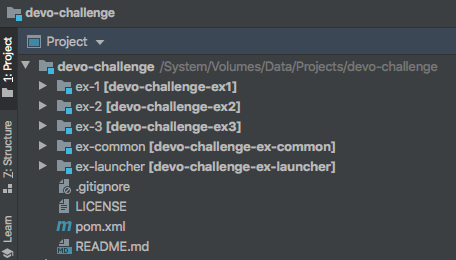
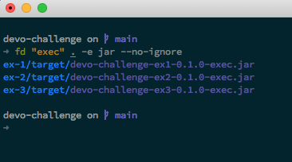
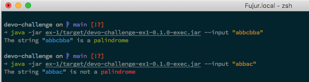
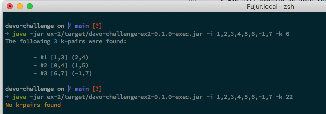
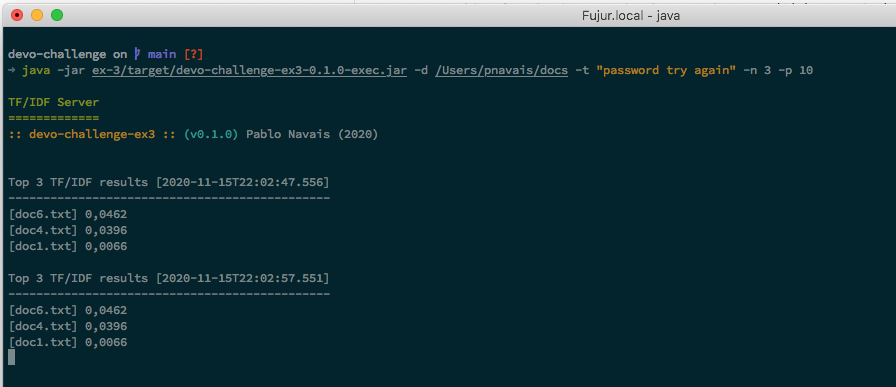
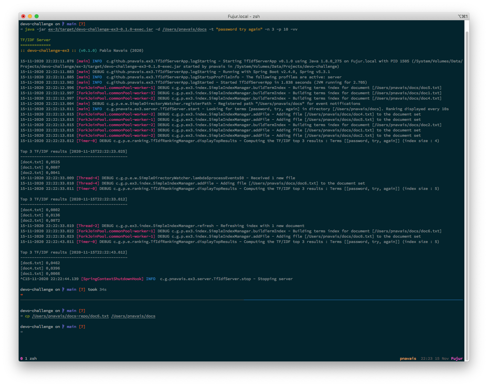
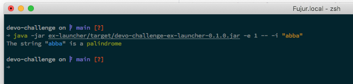

# devo-challenge
Devo challenge implementation

## Rationale
This is my implementation of the Devo challenge. It has been developed in Java 8 using Spring Boot (2.4.0) and packaged as a Maven multi-module project.<p>
Pre-packaged jars can be found in the (release area)[https://github.com/pnavais/devo-challenge/releases].

## Project Structure
Each exercise in the challenge has been defined in its own Maven module and a separate executable jar can be used for testing the implementation.
For each module, Junit 5 unit tests have been defined grouped in a suite.

The following modules have been defined : 
- ex1 : Contains the implementation of the first exercise  (Palindrome Checker)
- ex2 : Contains the implementation of the second exercise (K-Complementary pairs finder)
- ex3 : Contains the implementation of the third exercise  (Tf/Idf statistics server)
- ex-common : Contains utility methods common to all modules
- ex-launcher : Provides a simple command-line launcher to execute all exercises in a single Spring boot "fat" jar



## Development environment
The different exercises where developed and tested using the following system environment :
- OS    : Mac OS X 10.15.7 x86_64
- JDK   : Amazon Corretto JDK 8 (1.8.0_171)
- Maven : 3.6.3 

## Build instructions

Assuming Maven is installed execute the following command in the project root : 
```
mvn clean package
```
After succesful packaging the following structure is generated :



Each module provides an executable jar with a simple tester application.
Additionally a launcher has been created grouping all exercises in a single "fat" jar. 

Refer to [running section](#running-the-exercises) to find instructions on how to launch the exercise tester applications or global launcher.

## Exercises implementation details
### Exercise 1 : Palindrome checker
The algorithm coded evaluates an input string to determine if it represents a valid palindrome or not, that is, the string matches its reverse form.
Example : "abba" is valid palindrome , "abc" is not

The implementation of the palindrome algorithm is as follows:
 - The string input is indexed through its front and end (i_front, i_end), initially
   i_front = 0 and i_end = length of input - 1
 - On a loop while the "middle" of the string is not reached, the front
   index is incremented and the end one is decremented.
 - When the comparison between indexed element at front and end does not
   match an invalid palindrome is detected and the process is stopped.
 - If the "middle" of the string is reached that is i_front>=i_end a valid
   palindrome is detected and the process is complete.

Since the algorithm has to consider at most half the elements of the array it has a time complexity of O(n/2) == O(n) discarding constants.

### Exercise 2 : K-Complementary finder
The exercise asks to find/count K-complementary pairs in a given array of integers.
Given an integer Array A, any pair (i, j) is K-complementary if K = A[i] + A[j];
Example : A = [ 1, 2, 2, 3 ] k = 4 contains 2 valid k-pairs {0,3} and {1,2}

Two different algorithms were provided : 
- Count k-pairs algorithm
- Find actual k-pairs algorithm

The implementation of the k-complementary count algorithm is as follows:
 - For each current value in the array, the "distance" i.e. the difference
 between k and the value (i.e. the k-complementary) is checked in the map ,
 if found, the pairs count is increased by the number of occurrences of
 that complementary element.
 - The element is put in the map with an initial counter if not present
 or increased by one if already there.

Since the check / insertions in the map have a time complexity of O(1) and the algorithm performs a full loop across the input array, the total
time complexity is considered O(n).

NOTE: This algorithm does not account for duplicates, i.e. the pairs (i,j) and (j,i) are considered equals.

### Exercise 3 : Tf/Idf statistics server
The exercise asks to implement a program running as a daemon/service that is watching for new documents in a given folder, and dynamically updates the computed tf/idf for each document and the inferred ranking. 
The following assumptions have been made : 
- We have a directory D containing a document set S, with one file per document. 
- Documents will be added to that directory by external agents, but they will never be removed or overwritten. 
- We are given a set of terms TT, and asked to compute the tf/idf of TT for each document in D, and report the N top documents sorted by relevance. 

The implementation of the server resides in the class "TfIdfServer" which wires the key elements of the application : 
- The DirectoryWatcher : A simple directory watcher implemented using the provided Java Platform WatchService to account for incoming files.
- The IndexManager : The main business logic implementing the algorithm in charge of indexing the documents.
- The RangkingManager : A simple timer task allowing to query the index manager for statistics and displaying them on a given print stream (stdout by default)

The server starts a daemon thread and wait for file notifications to recompute the index. These notifications come as simple "events" using a very basic publish/subscribe pattern : the DirectoryWatcher notifies of incoming files, the TfIdfServer receives this notifications, wakes the thread from its waiting status and requests the refreshing of the index to the IndexManager.

The server starts also a timer task using the RankingManager to display the top N results at a given fixed rate.

The implementation of the IndexManager has been implemented in the class "SimpleIndexManager" which provides a basic implementation of the interface allowing to keep track of new files and building an index for the terms provided.

The implementation of the index is as follows :
  - A map will contain as keys the terms to index
  - The value of each key in the map consists of a set (avoiding duplicates) of the document tf statistic for the term.
 
In order to compute the idf of a given term per document, it would simply suffice of :
  - Looking for the term in the map (O(1) operation)
  - Looking for the document in the secondary map (O(1) operation) and extracting its tf value from the recorded value (DocTerm).
  - Dividing the tf value found by the number of documents in the set for this terms. That is, only documents
    containing the term will be present in the set.
 
The combined tf/idf for all the terms would consist of the average of all individual tf/idf term statistics.

## Running the exercises 

After building succesfully the project, at its root execute the executable jar for each individual exercise to launch its associated application.

For example, to run the PalindromeChecker application in ex1 :



The application provides the following flags : <p>
<li>-i, --input <pattern> : the string to check 

To run the KComplementaryFinder application in ex2 : 



The application provides the following flags : <p>
<li>-i, --input <array> : the integer array in a comma-separated format
<li>-k : the value of k

Finally, running the TF/IDF Statistics server can be made as follows : 



The application provides the following flags : 

<li>-d <dir>    : The directory to watch for documents. 
<li>-t <terms>  : The list of terms to lookup and index
<li>-n <top>    : The maximum number of documents to show in the ranking
<li>-p <period> : The period in seconds to display the updated ranking
<li>-v[vv]      : The level of verbosity
 
The following screenshot shows, with high verbosity level , the refreshing of the index upon file reception : 


 
 
Additionnaly all applications can be accesed from a single "fat" jar by executing the launcher : 



The application provides the following flags : <p>

<li>- e <number> : The number of the exercise to launch (1-3)

After this mandatory argument, a double dash "--" indicates the arguments to feed to the actual exercise application.
